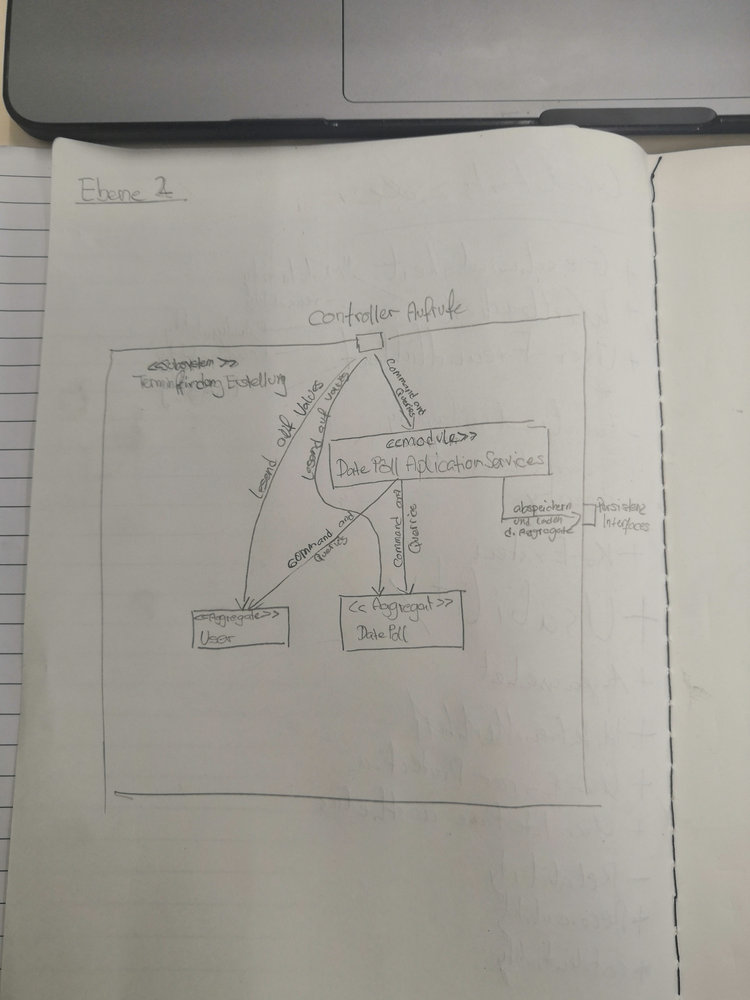

**Über arc42**

arc42, das Template zur Dokumentation von Software- und
Systemarchitekturen.

Erstellt von Dr. Gernot Starke, Dr. Peter Hruschka und Mitwirkenden.

Template Revision: 7.0 DE (asciidoc-based), January 2017

© We acknowledge that this document uses material from the arc42
architecture template, <http://www.arc42.de>. Created by Dr. Peter
Hruschka & Dr. Gernot Starke.

Einführung und Ziele {#section-introduction-and-goals}
====================

Aufgabenstellung {#_aufgabenstellung}
----------------
###Was beinhaltet das Projekt Terminfindung

- Das Projekt stellt einen Web-Service bereit, mit dem man Umfragen erstellen kann
- An erstellten Umfragen kann man teilnehmen
- Ergebnisse von fertig geführten Umfragen werden präsentiert

Qualitätsziele {#_qualitätsziele}
--------------
**Wartbarkeit:**

Unser wichtigstes Qualitätsziel ist **Wartbarkeit**, da wir, nachdem wir das Projekt ausliefern, nicht mehr dafür verantwortlich sind.
Daraus resultiert, dass unser Projekt möglichst gut **testbar** und **anlysierbar** sein soll.

**Benutzbarkeit:**

Ein weiteres wichtiges Qualitätsziel ist **Benutzbarkeit**. Unseren Service stellen wir allen Angehörigen der
Heinrich-Heine-Universität Düsseldorf bereit. Aufgrund der verschiedenen Backgrounds der Benutzerbasis soll unser Service
ohne Vorkenntnisse einfach und intuitiv benutzbar sein. Es soll keine Lernkurve geben. Der Service soll intuitiv
verständlich und sofort nutzbar sein. Außerdem wollen wir vermeiden, dass Benutzer unabsichtlich Fehler machen.

**Performance:**

**Performance** ist wichtig, damit Nutzer\*innnen Terminfindungen und Abstimmungen möglichst schnell initiieren bzw. durchführen können und dabei nicht frustriert sind. Daraus resultierend nehmen wir uns vor, dass jede Operation höchstens 2 Sekunden Antwortzeit hat.

**Sicherheit:**

Die Datensicherheit muss sichergestellt werden. Bei den Daten zu Terminfindung und Abstimmungen handelt es sich um
personenbezogene Daten, die in keinem Fall von nicht berechtigten Benutzern oder Angreifern eingesehen werden dürfen.

**Weniger wichtig sind folgende Qualitätsziele:**

**Verfügbarkeit:**
Es ist nicht kritisch für den Alltag an der Universität, wenn die Anwendung oder Teile davon für kurze Zeit nicht verfügbar sind. Beeinträchtigt wird dadurch lediglich das Ziel der einfachen Benutzbarkeit.

**Korrektheit**
Das System muss natürlich grundsätzlich funktionieren. Kleinere Bugs, die die Benutzbarkeit nicht wesentlich beeinträchtigen und die Datensicherheit nicht gefährden, sind allerdings akzeptabel.

Stakeholder {#_stakeholder}
-----------

| Rolle           | Erwartungshaltung                 |
|-----------------|-----------------------------------|
| Studierende und Lehrende der HHU   | Möchten untereinander möglichst reibungslos Termine verabreden, Fragen demokratisch klären und zur Konsensfindung Umfragen durchführen |
| Entwickler | Wollen ihr Praktikum bestehen und die vorgegebene Anwendung möglichst vollständig und fachgerecht implementieren |

Randbedingungen {#section-architecture-constraints}
===============

Technische Randbedingungen:
---------------------------

| Bedingung             | Erläuterungen, Gründe |
|-----------------------|-----------------------|
| Design als Self-Contained-System | Vereinfacht die Arbeit in Gruppen und die spätere Integration, da die Services untereinander so unabhängig wie möglich sind. |
| Auslieferung per Docker | Auslieferung möglichst einfach halten und die Lauffähigkeit ohne externe Abhängigkeiten garantieren. |
| Implementierung in Java mit Spring Boot | Randbedingung der Veranstaltung |

Konventionen:
---------------------------

| Konvention             | Erläuterungen, Gründe |
|-----------------------|-----------------------|
| Sprache | Dokumentation in Deutsch, Code in Englisch |
| Vorgehensmodell | Arbeit in Kleingruppen zu zweit oder dritt, regelmäßige Besprechung und Rücksprache. Kanban-Boards und To-Do-Listen werden verwendet, sind allerdings nicht zentraler Bestandteil des Modells. |
| Dokumentation | Dokumentation anhand von Arc42, zusätzlich Festhalten wichtiger Entscheidungen und Ergebnisse aus Plenum und Besprechungen. |

Kontextabgrenzung {#section-system-scope-and-context}
=================

Fachlicher Kontext {#_fachlicher_kontext}
------------------
Das System, das wir bereitstellen, ist ein Subsystem eines Web-Services der HHU, der den Angehörigen der Universität
als Online-Organisations-Service dient.

Technischer Kontext {#_technischer_kontext}
-------------------
Unsere Aufgabe ist es, unseren Service den Nutzer*innen bereitzustellen und sicherzustellen, dass nur berechtigte User
auf die entsprechenden Umfragen zugreifen können. Die Authentifizierung der User erfolgt extern. Die Anbindung an
andere Subsysteme erfolgt nur über Links.

Lösungsstrategie {#section-solution-strategy}
================

Um unser Ziel der **Wartbarkeit** zu erfüllen, haben wir uns für eine Onion-Architektur entschieden, deren Beschränkungen und Konventionen wir nur in wenigen Fällen oder idealerweise gar nicht verletzen wollen. Damit einher geht eine strikte Trennung der Domain und Infrastruktur.

Das Ziel der **Benutzbarkeit** ist besonders wichtig für unsere Anwendung. Wenn die Benutzer\*innen kein gutes Gefühl beim Bedienen unserer Anwendung haben, werden sie ein alternatives Produkt nutzen, Doodle beispielsweise oder einen anderen kostenfreien Dienst.

Wir haben uns recht früh entschieden, dass die Erstellung einer Terminabstimmung oder Abstimmung in einem Wizard geschehen sollte, da das auf mobilen Endgeräten eine übersichtlichere Darstellung ermöglicht. Wann immer möglich, wollen wir den Benutzer\*innen klares und eindeutiges Feedback zu ihren Eingaben geben, um Frust durch unklare  Validierungskriterien zu vermeiden. Außerdem muss ein Wizard ein gutes Konzept für die Navigation haben, damit der Zurück-Button im Browser funktioniert und keine Probleme durch mehrfach geöffnete Tabs oder Ähnliches entstehen.

Eine Lösung dafür ist „Spring Web Flow“, ein Teil des Spring-Projekts, mit dem man sogenannte „Flows“ orchestrieren, d.h. Benutzungsabläufe auf eine bestimmte Art und Weise definieren kann. Die Definition dieser Flows erfolgt per XML und ist hier ausführlich dokumentiert: https://docs.spring.io/spring-webflow/docs/current/reference/htmlsingle/index.html

Auch wenn Web Flow am Anfang gewöhnungsbedürftig und die Konfiguration per JavaConfig nicht sonderlich gut dokumentiert ist, erspart man sich auf lange Sicht Kopfschmerzen mit den oben genannten Kriterien eines guten Wizards. Der zentrale Vorteil von Web Flow ist neben der Navigierbarkeit im Flow die übersichtliche Darstellung von transaktionalen, mehrschrittigen Vorgängen. Jederzeit ist ersichtlich, in welchem Zustand sich ein Flow befindet und in welche Zustände er übergehen kann.

Um eine zusätzliche Komplexitätsebene zu Vermeidung und auf ausdrückliche Empfehlung unserer Tutoren hin haben wir uns für bezüglich Persistenz für JPA entschieden.

Bausteinsicht {#section-building-block-view}
=============

Whitebox Gesamtsystem {#_whitebox_gesamtsystem}
---------------------

***\<Übersichtsdiagramm\>***

Begründung

:   *\<Erläuternder Text\>*

Enthaltene Bausteine

:   *\<Beschreibung der enthaltenen Bausteine (Blackboxen)\>*

Wichtige Schnittstellen

:   *\<Beschreibung wichtiger Schnittstellen\>*

### \<Name Blackbox 1\> {#__name_blackbox_1}

*\<Zweck/Verantwortung\>*

*\<Schnittstelle(n)\>*

*\<(Optional) Qualitäts-/Leistungsmerkmale\>*

*\<(Optional) Ablageort/Datei(en)\>*

*\<(Optional) Erfüllte Anforderungen\>*

*\<(optional) Offene Punkte/Probleme/Risiken\>*

### \<Name Blackbox 2\> {#__name_blackbox_2}

*\<Blackbox-Template\>*

### \<Name Blackbox n\> {#__name_blackbox_n}

*\<Blackbox-Template\>*

### \<Name Schnittstelle 1\> {#__name_schnittstelle_1}

...

### \<Name Schnittstelle m\> {#__name_schnittstelle_m}

Ebene 2 {#_ebene_2}
-------

### Whitebox *\<Baustein 1\>* {#_whitebox_emphasis_baustein_1_emphasis}

*\<Whitebox-Template\>*

### Whitebox *\<Baustein 2\>* {#_whitebox_emphasis_baustein_2_emphasis}

### Whitebox *\<Baustein m\>* {#_whitebox_emphasis_baustein_m_emphasis}

*\<Whitebox-Template\>*

Ebene 3 {#_ebene_3}
-------

### Whitebox \<\_Baustein x.1\_\> {#_whitebox_baustein_x_1}

*\<Whitebox-Template\>*

### Whitebox \<\_Baustein x.2\_\> {#_whitebox_baustein_x_2}

*\<Whitebox-Template\>*

### Whitebox \<\_Baustein y.1\_\> {#_whitebox_baustein_y_1}

*\<Whitebox-Template\>*

Laufzeitsicht {#section-runtime-view}
=============

*\<Bezeichnung Laufzeitszenario 1\>* {#__emphasis_bezeichnung_laufzeitszenario_1_emphasis}
------------------------------------

-   \<hier Laufzeitdiagramm oder Ablaufbeschreibung einfügen\>

-   \<hier Besonderheiten bei dem Zusammenspiel der Bausteine in diesem
    Szenario erläutern\>

*\<Bezeichnung Laufzeitszenario 2\>* {#__emphasis_bezeichnung_laufzeitszenario_2_emphasis}
------------------------------------

...

*\<Bezeichnung Laufzeitszenario n\>* {#__emphasis_bezeichnung_laufzeitszenario_n_emphasis}
------------------------------------

...

Verteilungssicht {#section-deployment-view}
================

Infrastruktur Ebene 1 {#_infrastruktur_ebene_1}
---------------------

***\<Übersichtsdiagramm\>***

Begründung

:   *\<Erläuternder Text\>*

Qualitäts- und/oder Leistungsmerkmale

:   *\<Erläuternder Text\>*

Zuordnung von Bausteinen zu Infrastruktur

:   *\<Beschreibung der Zuordnung\>*

Infrastruktur Ebene 2 {#_infrastruktur_ebene_2}
---------------------

### *\<Infrastrukturelement 1\>* {#__emphasis_infrastrukturelement_1_emphasis}

*\<Diagramm + Erläuterungen\>*

### *\<Infrastrukturelement 2\>* {#__emphasis_infrastrukturelement_2_emphasis}

*\<Diagramm + Erläuterungen\>*

...

### *\<Infrastrukturelement n\>* {#__emphasis_infrastrukturelement_n_emphasis}

*\<Diagramm + Erläuterungen\>*

Querschnittliche Konzepte {#section-concepts}
=========================

*\<Konzept 1\>* {#__emphasis_konzept_1_emphasis}
---------------

*\<Erklärung\>*

*\<Konzept 2\>* {#__emphasis_konzept_2_emphasis}
---------------

*\<Erklärung\>*

...

*\<Konzept n\>* {#__emphasis_konzept_n_emphasis}
---------------

*\<Erklärung\>*

Entwurfsentscheidungen {#section-design-decisions}
======================

Qualitätsanforderungen {#section-quality-scenarios}
======================

Qualitätsbaum {#_qualit_tsbaum}
-------------

Qualitätsszenarien {#_qualit_tsszenarien}
------------------

Risiken und technische Schulden {#section-technical-risks}
===============================

Glossar {#section-glossary}
=======

+-----------------------+-----------------------------------------------+
| Begriff               | Definition                                    |
+=======================+===============================================+
| *\<Begriff-1\>*       | *\<Definition-1\>*                            |
+-----------------------+-----------------------------------------------+
| *\<Begriff-2*         | *\<Definition-2\>*                            |
+-----------------------+-----------------------------------------------+
